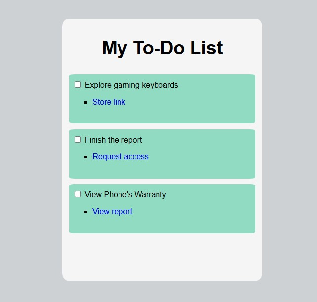

# To-Do List Application

## Description
This project is a simple **To-Do List Application** built using HTML and CSS. It allows users to keep track of tasks, with each task containing an input checkbox and a label for the task description. The application also supports sub-items (links) related to each task.

## Features
- A clean and responsive layout.
- Unordered list (`ul`) styled without default bullets.
- Tasks are checkable with checkboxes.
- Links are included as sub-items for additional information.
- Links change color dynamically based on interaction states (hover, focus, active, and visited).

## Prerequisites
To view and use the project, you need:
- A web browser (e.g., Chrome, Firefox, Edge).
- A code editor (e.g., VSCode, Sublime Text) for customization.

## File Structure
- ├── index.html # Main HTML file ├── styles.css # CSS file for styling └── README.md # Documentation (this file)


## How to Use
1. Clone or download the project to your local machine:
   ```bash
   git clone https://github.com/Muhammad-Kamran-Khan/todo-list/
2. Open the `index.html` file in your web browser to view the application.
3. To customize styles, edit the `styles.css` file.

## Customization

- **Modify Tasks**: Add, remove, or edit list items in the `index.html` file.
- **Change Styles**: Update colors, fonts, or layout in the `styles.css` file.

## Interaction States for Links

The links in the sub-items respond to user actions:

- **Hover**: Turns black.
- **Focus**: Displays a red outline.
- **Active**: Turns white while being clicked.
- **Visited**: Changes to purple after being visited.

## Preview




### Instructions for copying:
1. Create a new file named `README.md` in the root directory of your repository.
2. Copy the above markdown content into the `README.md` file.
3. Commit and push the file to your GitHub repository.

Let me know if you'd like help with any further adjustments!
